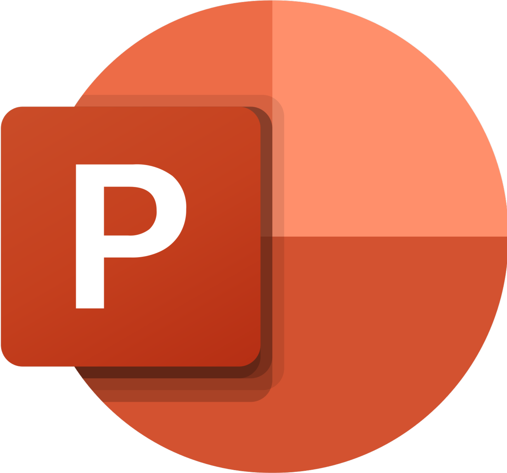

# AutoRent Pro - Car Rental Platform
  
   

  
   
   
   

## 🌟 Project Overview
AutoRent Pro is a responsive website designed to streamline the car rental process. Our platform offers:

- Simple interface for booking funds
- Mobile-friendly design
- Flexible rental options (daily/weekly/monthly)
- Transparent pricing with no hidden fees

## 🌐 Key Pages

1. **Home page** - Information about us
2. **Cars page** - All our cars
3. **Locations page** - А map with all our offices and a direct link to their location
4. **Contact Page** - A page with information about our head office and information about the creators of the site
5. **Reviews** - Our website feedback page

## Used Programs

### 📈 Markup languages

  
  

### </> Code editors

  
  

### 💬📝 Communication & Documentation

  
  
  

### 🎨 Design

 
  
  
  

## 📂 Documentation & Presentation

### 📋 Documentation
[Documentation](https://codingburgas-my.sharepoint.com/:w:/g/personal/tstodorov24_codingburgas_bg/EbAx8Tr9iH9FmV2g6aXX5oYBXLSAXqzGwI7MyBN5J9jOng?e=MvqDwD)
### 🎤 Presentation
[Presentation](https://codingburgas-my.sharepoint.com/:p:/g/personal/gmmiteva24_codingburgas_bg/EYBZzQgWCyJPjo1Z_hpwsVoBz2693OBaTkBr7sWCV85xoQ?e=Lkj62x)

## 👨🏻‍💻 Team Members

| Name          | Class | Role               |
|---------------|-------|--------------------|
| [ Teodor Spasov Todorov ](https://github.com/TSTodorov24)|8A| Scrum trainer |
| [Selin Aydanova Vatansever](https://github.com/SAVatansever24) |8B| Designer    |
| [Gabriela Mitkova Miteva](https://github.com/gmmiteva24)|8V|  HTML Developer   |
| [Alexander Ivaylov Petrov](https://github.com/AIPetrov24)  |8G| CSS Developer  |

## 📈 Project Milestones
- **Phase 1**:  Creating HTML files
- **Phase 2**:  Adding images
- **Phase 3**:  Styling with CSS
- **Phase 4**:  Creating documentation

---

  Developed by Auto Rent Pro  
   2025

